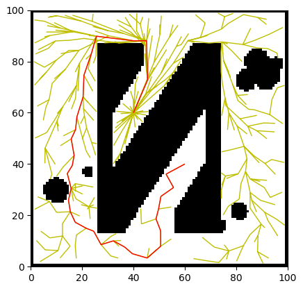
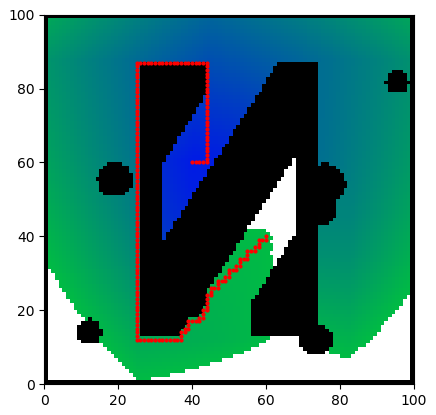
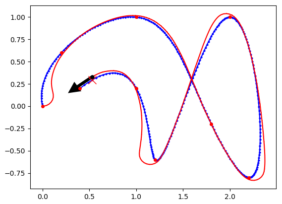
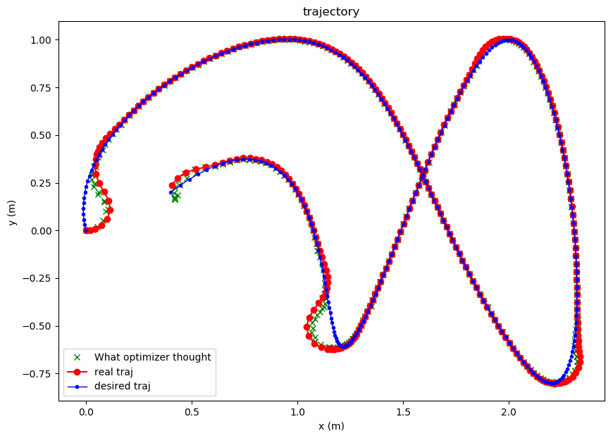
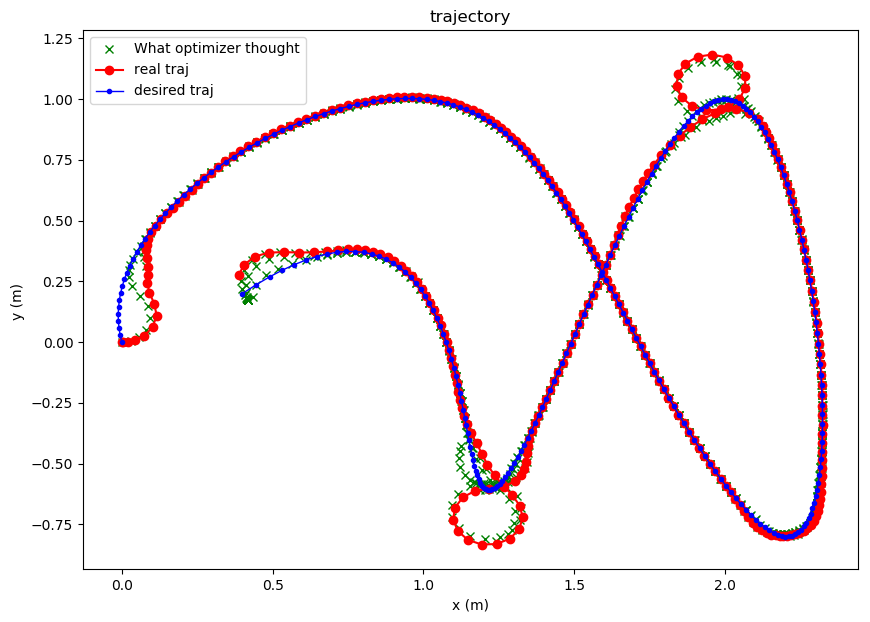
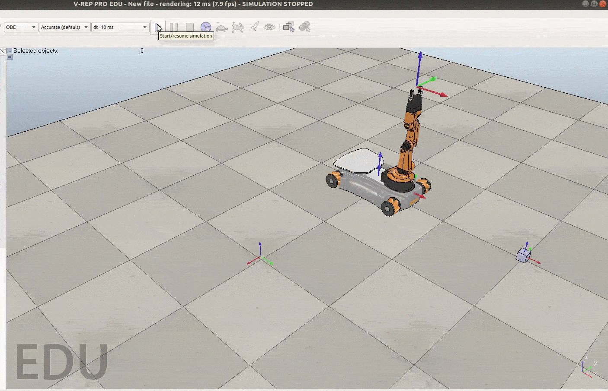

# 1. Intro
This repo contains several of my practices on motion planning algorithms written in Python (2.7).

The contents and files are:
* path_planning:
[RRT*](path_planning/RRTstar.py), 
[A*](path_planning/AStar.py)
* path_tracking:
[FollowLine](path_tracking/FollowLine.py), 
[PurePursuit](path_tracking/PurePursuit.py),
and a very simple [NonlinearOptimization](path_tracking/NonlinearOptimization.py) method.
* A (homework) report for planning a Youbot mobile manipulator. Due to copy right, my code is not uploaded, but only the document.

Directory:
- [1. Intro](#1-intro)
- [2. Path planning](#2-path-planning)
  - [2.1 RRT*](#21-rrt)
  - [2.2 A*](#22-a)
- [3. Path tracking](#3-path-tracking)
  - [3.0 Library functions](#30-library-functions)
    - [3.0.1 Robot model](#301-robot-model)
    - [3.0.2 Trajectory](#302-trajectory)
  - [3.1 Pure Pursuit](#31-pure-pursuit)
  - [3.2 Follow Line](#32-follow-line)
  - [3.3 Non-linear Optimization](#33-non-linear-optimization)
- [4. Youbot motion planning](#4-youbot-motion-planning)

Descriptions and image results are shown below. More details are in each folder's README or described at the begining of each script.

# 2. Path planning

## 2.1 RRT*
[RRTstar.py](path_planning/RRTstar.py).
The image for grid map is "images/map.png". The result is:

## 2.2 A*
[AStar.py](path_planning/AStar.py). The code is written based on the [Pseudocode on Wiki](
https://en.wikipedia.org/wiki/A*_search_algorithm#Pseudocode).

# 3. Path tracking

## 3.0 Library functions

### 3.0.1 Robot model
The robot model for simulation is the single track model, where the robot has two wheels: (1) one in the front for setting the driving direction, and (2) one at the back for generating velociy. It's set up in this file [lib_mylib/myrobot.py](lib_mylib/myrobot.py). 

The control input for the user is the (1) linear velocity **u** and (2) angular velocity **w** of the robot. 

However, these two control input values might not be achieved, because the lowest level input to the robot in simulation is the (1) accheleration of the rear wheel, (2) and steering speed of the front wheel (with a low level controller). Besides, the maximum angular velocity of the robot is also subject to the maximum real wheel velocity and the maximum front wheel steering angle, which makes the input **w** not be achieved at higher risks. (Still, I'm using **u** and **w** as user's control input, because it's easier to control the robot.)

### 3.0.2 Trajectory

The trajectory points are generated by 3rd-order interpolatation, see [lib_mylib/myspline.py](lib_mylib/myspline.py). It's just a simple wrapped up of "scipy.interpolate".

A trajectory class is written in [lib_mylib/mytrajectory.py](lib_mylib/mytrajectory.py).
It reads in the trajecotry {x(t), y(t)} of the robot and then provides some common operations on them, such as taking derivative and quering pos at a given time. It also provides a function for integrating the path length and do time scalling. (I tested this time scaling on the Non-linear Optimization script, but it worked bad. Need furthere testing.)

## 3.1 Pure Pursuit
[PurePursuit.py](path_tracking/PurePursuit.py).
An implemntation of the simple Pure Pursuit algorithm using proportional control.

## 3.2 Follow Line
[FollowLine.py](path_tracking/FollowLine.py). This algorithm will reduces the distance between the robot and the reference trajectory. The velocity is set by following rule:
* The robot car's velocity is set as a constant (path_length / time). 
* The angeluar velocity is based on the distance between robot current pos and the nearest trajectory point.

## 3.3 Non-linear Optimization
I wrote a very simple non-linear optimization based motion planning demo, see [NonlinearOptimization.py](path_tracking/NonlinearOptimization.py). The result of my simple implementation is that the path tracking performance is not so good.

The cost function is the distance between robot current pose and a goal point (pose) on the reference trajecotry.

The 5 variables to optimize are:
  * v, w: Control input of the desired linear and angular velocity for the robot (which might not be achieved).
  * x, y, yaw: current pose of robot.

Constraints:  
  * The relationship between (v,w) and (x,y,yaw) satisfies the 1st-order integration.
  * The w is smaller than the w_max, where w_max is subject to v and max steering angle. If without this, the trajectory of what optimization thinks will be different from the real one.
  * Constrain on the acceleration of linear velocity.

More descriptions are written inside the .py script.

Two results are shown below. The green line is what the optimizer thinks of the real trajectory.

Figure 1. Plan for every 0.5s with a future of 1s.

Figure 2. Plan for every 1s with a future of 3s.

As you can see, there is some problem with Figure 2. Though in Figure 2, the robot's 1st turn is better than Figure 1, the 2nd and 3rd turn goes a large strange circle. 

I guess (I'm really not sure) the reason is:
* Due to the splining method, there are many points in a turning, in other words, the referene **u** is small but **w** is large. However, when u is small, for the single-track robot, the max w also becomes small, which makes it unable to achieve the large **w** to track the trajectory. So the optimization algorithms decides to make a large circle instead.
* Maybe something wrong with the optimizaiton method in setting up the constrain, so that robot model between the optimization and the real one are different.
  
The solution is to change the cost function. And to read more papers and learn more about optimization-based planning method. (However, I feel I won't work on this anymore.)

# 4. Youbot motion planning

This is the Final Homework of **ME 449 Robotic Manipulation**.  
The mobile manipulator, i.e. youBot Robot, is simulated, motion planned, and controlled in Python. The data are output to .csv file and shown in V-REP as seen below:  

The project includes the following algorithms/procedures:

1. Code the **kinematic model** of mobile chasis (4 Mecanum wheels) and arm (5 joints), including **forward kinematics** and **Jacobian**.
2. **Plan a reference(desired) trajectory** for the end-effector, i.e. gripper, so it picks up a block and carry it to the goal position. The interpolation of the reference trajectory is done in the 6-vec **exponential coordinate**. 
3. Use **Feedforwrad + P + I controller** to let the gripper trackes the reference trajectory. 
4. Do the simulation in Python. Output the wheel angles and arm joint angle to txt, and make a video by V-REP.

A figure shows the converges of end-effector's error between real and desired pose represented in exponential coordinates:

**[!!! Due to copy right of the homework, I've deleted my program files. You may contact me if you are interested in this project.]**
