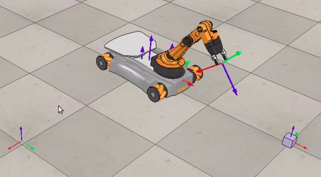
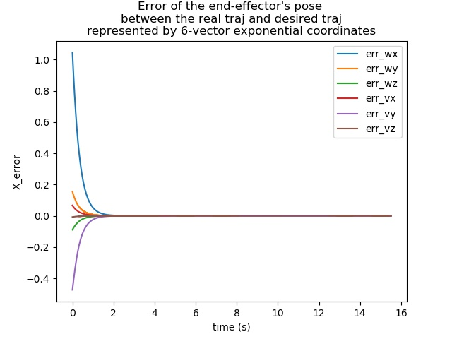
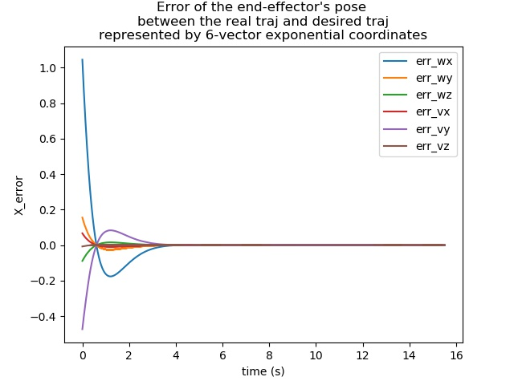

**[!!! Due to copy right of the homework, I've deleted my program. There is no need to read this README unless you are very intersted. !!!]**

This is the Final Homework of **ME 449 Robotic Manipulation**. See this [page](http://hades.mech.northwestern.edu/index.php/Mobile_Manipulation_Capstone) for the requirements and tutorials.


Video link:  
http://feiyuchen.com/wp-content/uploads/ME449_youbot_Kp3_Ki0.mp4

Image of Youbot moving towards the cube:  


# 1. Contents

This homework includes the following contents:

1. Code the **kinematic model** of mobile chasis (4 Mecanum wheels) and arm (5 joints), including **forward kinematics** and **Jacobian**.
2. **Plan a reference trajectory** for the end-effector, i.e. gripper, so it picks up a block and carry it to the goal position.  
3. Use **Feedforwrad + P + I controller** to let the gripper trackes the reference trajectory. The pose error is computed in **exponential coordinate**.
4. Do the simulation in Python. Output the wheel angles and arm joint angle to txt, and make a video by V-REP.  

# 2. Softwares and Library Prerequisite

Please get the V-REP and "modern robotics" Python library as describe on our course website:    
http://hades.mech.northwestern.edu/index.php/Coursera_Resources#Things_you_should_complete_before_taking_any_course.

Please also get the **Scene6_youBot_cube.ttt** from our course website:   
http://hades.mech.northwestern.edu/index.php/V-REP_Introduction#Scene_6:_CSV_Mobile_Manipulation_youBot.  
After creating the text file which contains wheel and joint angles, you can open this Scene6 in V-REP, load the text, and see the animation of how Youbot moves.   
You may need to read through this homework page to get a better understanding of this homework.

# 3. How to run

Please run:
> $ mkdir test && cd test  
> $ python2 ../src/run_this.py --CUBE_POSE_0 "1 0 0" --CUBE_POSE_1 "0 -1 -pi/2" --DT_CONTROLLER 0.005 --DT_TRAJ 0.01 --COEF_KP 3 --COEF_KI 0

It outputs 3 files:
* **result_traj.csv**: A list of wheel and joint angles, with a time interval specified by DT_TRAJ. Please open V-REP, load **Scene6_youBot_cube.ttt**, and then load this .csv file to see the animation.
* **result_Xerr.csv**: The X error at each time for plotting. X error denotes the error between reference and current pose of gripper represented in exponential coordinate. It's a 6-vector with *w* at top and *v* at bottom.
* **result_Xerr.jpg**: The figure of X error.

The arguments for running this main file [src/run_this.py](src/run_this.py) are:
* **CUBE_POSE_0**, **CUBE_POSE_1**: Initial and target poses of the cube. 
* **DT_TRAJ**: Time interval between two reference trajectory points.
* **DT_CONTROLLER**: Control period. This is also the low-level simulation period.
* **COEF_KP**, **COEF_KI**: Coefficient Kp and Ki for proportional and integral controller.


# 4. Files  

## 4.1 [myObjects.py](src/myObjects.py)  

This file contains the classes of 3 objects:  
* Chase   
* Arm  
* Cube  

Their geometry and kinematics (if have) are described here, such as forward/inverse kinematics and Jacobian.

## 4.2 [myRobot.py](src/myRobot.py)  

This file imports [myObjects.py](src/myObjects.py) and creates a class called **Robot**.  
The robot's geometry, kinematics, and behaviors are defined here.  

Some of its member functions are:   
* get_current_states  
* compute_body_jacobian  
* step (do simulation for dt seconds, and update the robot state)   

This file also contains the test case for [**Milestone1**](http://hades.mech.northwestern.edu/index.php/Mobile_Manipulation_Capstone#Milestone_1:_youBot_Kinematics_Simulator_and_csv_Output). If you run it, it generates a csv file called "test_ms1_NextStage.csv".

## 4.3 [myTrajectoryGenerator.py](src/myTrajectoryGenerator.py)  

This is from [**Milestone2**](http://hades.mech.northwestern.edu/index.php/Mobile_Manipulation_Capstone#Milestone_2:_Reference_Trajectory_Generation) (with test case inside it).    
The funtion **TrajectoryGenerator** reads in the initial and desired poses of robots and objects, and outputs the trajectory.

## 4.4 [myFeedbackControl.py](src/myFeedbackControl.py)  

This is from [**Milestone3**](http://hades.mech.northwestern.edu/index.php/Mobile_Manipulation_Capstone#Milestone_3:_Feedforward_Control) (with test case inside it).     
It defines a class called **Feedforward_Controller**. Initialize it, and then you can call its member function **Feedforward_Control** to generate the desired "end-effector twist".  

## 4.5 [run_this.py](src/run_this.py)  

This is the **main** file of my final project.

This script imports:
* "robot" class from milestone 1.
* "TrajectoryGenerator" function from milestone 2.
* "Feedforward_Controller" function from  milestone 3.

The pseudo-code of the main function is:
``` 
Create a robot.
Generate the desired trajectory.
Loop (time = t_start ~ t_end){
   Get the next desired trajectory point.
   Do low level simulation: Loop{
        v_desired = Feedforward_Control()
        robot.step(v_desired)
   }
}
```


## 4.6 Others
* [src/mylib.py](src/mylib.py)  
I put some simple functions here.

* [src/plot_Xerr.py](src/plot_Xerr.py)  
This is for ploting the X_error.


# 5 Results

## 5.1 Settings

Joint velocity:
```
w_max of robot arm's joints: 10
w_max of wheels angles: 15
```

Init pose of robot:
```
ROBOT_INIT_X=-0.5  
ROBOT_INIT_Y=0.2  
ROBOT_INIT_YAW=0  
ROBOT_INIT_THETA_LIST=[pi/3,0,0.2,-1.6,0]  
(Here I use robot's x, y, yaw to denote the chase's x, y, yaw)
```

## 5.2 Kp=3, Ki=0. No error.
Plot of X error:  


## 5.3 Kp=3, Ki=3. Overshoot. 
Plot of X error:  


## 5.4 Change Cube's pos
You can also change the pos of cube.
Set initial config of cube as [1, 0.3, 0.2], and goal pos as [0.1, -1, -2]  
Besides, set Kp=3, Ki=0 as in Section 5.2.

> $ python2 ../src/run_this.py --CUBE_POSE_0 "1 0.3 0.2" --CUBE_POSE_1 "0.1 -1 -2" --DT_CONTROLLER 0.005 --DT_TRAJ 0.01 --COEF_KP 3 --COEF_KI 0

The X error will also fastly converge to 0.

# 6. Conclusion

In this homework, I simulated the Youbot in Python, designed the reference trajectory and controller, and tested the parameters.

The **Feedforward+P controller** works pretty well, and there is no need to add an integral term. The error quickly converges to zero in 2 seconds.

